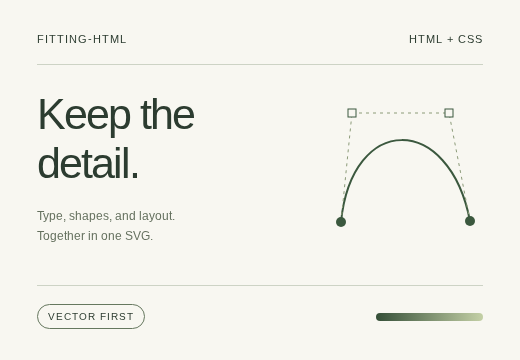
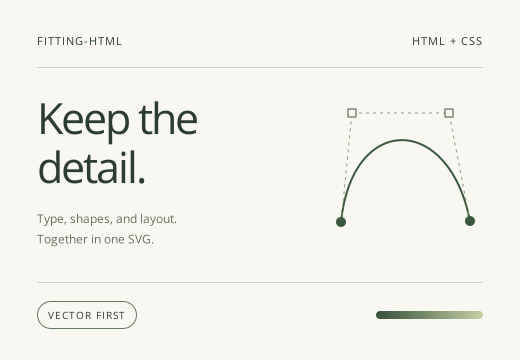

# fith — HTML to SVG

**将浏览器渲染后的 HTML 转换为便于分享的、向量优先的 SVG。**

[English](./README.md) · [简体中文](./README.zh-CN.md)

fith 读取浏览器计算后的布局，将 HTML 页面或元素捕获为 SVG。文字、盒子、边框、渐变及支持的效果转换为 SVG 图形；复杂区域则在后端具备截图能力时，以局部截图内联兜底。

适合从现有 HTML 导出 UI 卡片、仪表盘、文档插图和页面快照。输出是一份静态 SVG，图片与已捕获的栅格区域内联在同一文件中，字体处理方式可选。

> 向量优先不代表全向量，也不保证任意页面都能像素级还原。保真度取决于页面、字体、捕获后端和 SVG 查看器，详见[支持范围与限制](#支持范围与限制)。

## 转换示例

仓库包含[示例 HTML 卡片](./homepage/public/examples/card.html)及其 [SVG 输出](./homepage/public/examples/card.svg)。

| HTML 截图 | SVG 输出 |
| --- | --- |
|  |  |

## 名称与理念

**fith** 源自 **fitting HTML**：`fit` 表示「拟合」，`h` 表示 HTML。
「拟合万物」是命名背后的理念；本项目聚焦于已渲染 HTML 页面的视觉重建与 SVG 导出。

## 项目特点

- **复用浏览器布局。** 直接使用浏览器的布局结果，无需重新实现 HTML 与 CSS 排版。
- **向量优先。** 支持的文字与图形保留为 SVG 元素，复杂内容通过局部栅格化兜底。
- **资源内联。** 内联图片及可读取的 `@font-face` 字体，也可将支持的字形转为路径。
- **三种运行环境。** Node API / CLI、浏览器页内库、Chrome Manifest V3 扩展共用同一套 DOM 捕获与 SVG 发射核心。
- **保真度可验证。** 使用自带的像素差分工具，在 Chromium 中比较原 HTML 与生成的 SVG。

## 快速开始

### 从源码构建

需要 **Node.js 18+** 和 **pnpm**。仓库在 `package.json` 中指定 pnpm 版本，CI 使用 Node.js 22。Node 后端还需要 Chromium。

```bash
git clone https://github.com/0x0079/fith.git
cd fith
pnpm install
pnpm exec playwright install chromium
pnpm build
```

Linux 环境如缺少浏览器系统依赖，可使用 `pnpm exec playwright install --with-deps chromium`。

在仓库根目录转换自带示例：

```bash
node dist/backends/node/cli.js homepage/public/examples/card.html \
  -o card.svg --width 520 --height 360 --font-mode embed
```

本文以源码仓库为安装入口，不依赖 npm 发版或 Chrome 应用商店上架。

### Node API

将以下代码保存为仓库根目录的 `convert.mjs`，运行 `node convert.mjs`：

```js
import { writeFile } from 'node:fs/promises';
import { htmlToSvg } from './dist/index.js';

const svg = await htmlToSvg(
  '<html><body><h1>Hello, SVG</h1><p>Made from HTML.</p></body></html>',
  { width: 800, height: 300, fontMode: 'embed' },
);

await writeFile('page.svg', svg, 'utf8');
```

在其他项目中安装或链接 fitting-html 后，将 `./dist/index.js` 改为 `fitting-html` 即可。

## 使用方式

### HTML、URL 与已有 Playwright 页面

```js
import { htmlToSvg } from './dist/index.js';

// 直接传入的字符串会被视为 HTML；URL 必须使用 { url }。
const fromHtml = await htmlToSvg('<h1>Hello</h1>', { width: 1280 });
const fromUrl = await htmlToSvg(
  { url: 'https://example.com' },
  { width: 1280, height: 720 },
);

// 使用已有 Playwright Page 时，先自行准备页面：
// await page.goto(...); await page.waitForSelector(...);
// const fromPage = await htmlToSvg({ page }, { width: 1280 });
```

Node 后端加载 HTML 或 URL 时等待 `networkidle`，捕获前等待 `document.fonts.ready`。可通过 `settleMs` 增加等待时间；需要登录或等待动态内容时，可传入已准备好的 Playwright 页面。捕获会调整已有页面的视口，浏览器生命周期仍由调用方管理。

HTML 字符串与 CLI 文件输入通过 `page.setContent` 加载，没有基于文件路径的资源地址。包含相对路径的图片、样式或脚本时，请使用绝对 URL、显式 `<base href>`，或通过 HTTP 服务加载页面后捕获 URL。

#### Node 选项

| 选项 | 默认值 | 说明 |
| --- | --- | --- |
| `width` | 必填 | 视口宽度，单位为 CSS 像素。 |
| `height` | 文档高度 | 输出高度，单位为 CSS 像素；省略时测量文档高度并扩展视口。 |
| `deviceScaleFactor` | `1` | 浏览器上下文及栅格截图的像素密度，SVG 坐标仍使用 CSS 像素。传入已有 Page 时，像素密度由其上下文决定。 |
| `fontMode` | `'embed'` | `'embed'`、`'outline'` 或 `'none'`，见[字体处理](#字体处理)。 |
| `settleMs` | `0` | 捕获前额外等待的毫秒数。 |
| `executablePath` | Playwright Chromium | 自定义 Chromium 可执行文件路径。 |
| `launchArgs` | 后端默认参数 | 覆盖 Chromium 启动参数。 |
| `guaranteeFloor` | `false` | 在向量内容下嵌入整页截图；增加文件大小，也可能出现叠加伪影。 |
| `diffPatch` | `false` | 在 Chromium 中重新渲染 SVG，与原页面对比后叠加局部栅格补丁；增加捕获开销和栅格内容。 |

`guaranteeFloor` 和 `diffPatch` 是可选的保真辅助选项，不保证输出全向量或完全一致。

### CLI

在源码仓库中直接运行编译后的 CLI：

```bash
node dist/backends/node/cli.js input.html -o out.svg \
  --width 1280 --scale 2 --font-mode outline

node dist/backends/node/cli.js https://example.com \
  -o example.svg --width 1280 --height 720
```

安装或链接包后，同一 CLI 可通过 `fitting-html` 命令调用。默认宽度为 `1280`、缩放比例为 `1`、字体模式为 `embed`、输出文件为 `out.svg`。省略 `--height` 时使用文档高度。CLI 支持通过 `CHROMIUM_PATH` 指定 Chromium 可执行文件。

仓库另有开发辅助命令 `pnpm render input.html out.svg 1280`，使用 `CHROMIUM_PATH` 或开发依赖 `@sparticuz/chromium`。

### 浏览器页内库

在已安装或本地链接 fitting-html 的浏览器项目中，打包浏览器入口：

```ts
import { captureCurrentPage, captureElement } from 'fitting-html/browser';

const pageSvg = await captureCurrentPage({ fontMode: 'embed' });
const visibleSvg = await captureCurrentPage({ viewportOnly: true });

const card = document.querySelector('.card');
if (card) {
  const cardSvg = await captureElement(card, { fontMode: 'embed' });
  console.log(cardSvg);
}
```

页内库使用 DOM API，运行时不依赖 Node 或 Playwright。它捕获当前布局；`width` 与 `height` 控制捕获尺寸，不会创建新的浏览器视口。

- `viewportOnly: true` 用于捕获当前页面可视区，默认捕获完整文档；元素捕获裁剪到选中的子树。
- `rasterize(rect, scale)` 由调用方提供截图能力，返回 data URI 或 `null`。未提供时，需要栅格回退的区域会被省略。
- 使用 `fontMode: 'outline'` 时，调用方还需提供 `outline` 回调。浏览器入口没有导出字形轮廓器工厂，仅设置模式不会把文字转成路径。

### Chrome 扩展

```bash
pnpm build:extension
```

打开 `chrome://extensions`，启用**开发者模式**，点击**加载已解压的扩展程序**，选择 `dist/extension/`。

- 捕获**可视区域**（默认）、**整页**或**选中的元素**。
- 选择下载、预览或两者同时进行；预览支持缩放与背景切换。
- 通过面板、`Alt+Shift+S` 或右键菜单进入元素选择模式，按 `Esc` 取消。
- 字体支持 `embed` 与 `none`，扩展暂不支持 outline 模式。

扩展不会滚动文档来拼接截图。可视区栅格回退使用 `captureVisibleTab`；整页捕获可通过可选的 **debugger** 权限获取视口外区域截图。拒绝该权限时，视口外栅格区域会被省略，支持的向量内容仍可导出。浏览器内部页面和扩展商店页面无法捕获。

扩展声明了 `activeTab`、`tabs`、`scripting`、`contextMenus`、`storage` 权限及 `<all_urls>` 主机访问权限，`debugger` 为可选权限。完整声明见 [manifest](./src/backends/extension/manifest.json)。

## 字体处理

| 模式 | 行为 | 取舍 |
| --- | --- | --- |
| `embed` | 保留 SVG 文本，内联可读取的 `@font-face` 字体数据。 | 文字可选中，但不会自动内嵌系统字体；字体加载与跨域访问会影响结果。 |
| `outline` | 在有可用字体时，将字形转换为 SVG 路径。 | 已转换的文字无法按文本选中或编辑；缺失或不支持的字体可能回退为 SVG 文本。 |
| `none` | 仅引用字体族名称。 | 显示效果依赖查看环境安装的字体。 |

Node 的 outline 模式通过 `fontconfig`（`fc-match`）解析系统字体。使用该路径时需安装 fontconfig 与所需字体，尤其是在 Linux 上。字体格式和复杂文本塑形可能限制轮廓化的保真度，请验证实际输出。只内嵌或分发你有权分享的字体和其他资源。

## 支持范围与限制

**可向量化的内容包括：**盒子背景、边框与圆角、外阴影、outline 描边、线性渐变、按行定位的文字及其间距/装饰/大小写变换/省略号/渐变填充、列表标记、内联 SVG、带 `object-fit` 的图片、支持的装饰性伪元素、overflow 裁剪、不透明度、平移与缩放、转换为 sRGB 的现代 CSS 颜色、开放的 shadow DOM 和 `display: contents`。

**可能触发栅格回退的内容包括：**径向/锥形/多层渐变、内阴影、滤镜与背景滤镜、混合模式、mask 和 clip-path、旋转/斜切/3D 变换、原生表单控件、canvas、video、iframe、封闭的 shadow DOM，以及无法直接读取的图片。

实际覆盖取决于后端和 DOM 结构，尤其需要注意：

- 页内库与扩展禁用了容器栅格回退，避免与子元素重复绘制；部分复杂容器效果只能尽力还原。
- 页内库与扩展捕获完整文档时会展开滚动容器内容，可视区捕获保留当前视图。Node 使用自己的视口调整方式，因此不同后端的结果可能不同。
- 输出是静态快照，不保留交互、应用逻辑、动画或尚未渲染的懒加载内容。
- 一份 SVG 文件可以包含栅格图片。字体可用性、跨域资源和查看器支持仍会影响可移植性与外观。
- Chromium 像素对比衡量的是 Chromium 中的渲染效果；交付前还应在目标 SVG 查看器或设计工具中检查。

## 工作原理

```text
浏览器渲染后的 HTML → DOM 捕获 → Scene IR → SVG 发射器 → SVG 文件
                                    ↑
                              后端提供局部截图
```

浏览器负责计算布局。捕获核心读取 DOM 几何信息和计算样式，生成场景表示，再由发射器转换为 SVG。各后端按自身能力提供浏览器访问、截图与字体解析。

| 目录 | 用途 |
| --- | --- |
| `src/core/` | DOM 捕获、场景类型、SVG 发射，不依赖 Node 运行时。 |
| `src/backends/node/` | Playwright 集成、字体解析、CLI 和差分补丁。 |
| `src/backends/browser/` | 页内 API 与栅格适配工具。 |
| `src/backends/extension/` | Manifest V3 面板、捕获 worker、内容脚本及预览器。 |
| `test/` | 单元测试、HTML fixture 与视觉回归测试。 |
| `examples/` | Ant Design 和 MUI 示例应用。 |
| `homepage/` | 项目网站与示例资源。 |

实现细节见 [DESIGN.md](./DESIGN.md)，更多调查见[保真度研究](./docs/fidelity-research.md)。这两份文档目前为中文。

## 开发与验证

```bash
pnpm build
pnpm build:extension
pnpm test

# 比较自己的 HTML 或 URL 与生成的 SVG
pnpm validate ./homepage/public/examples/card.html card 520 360 embed
pnpm validate https://example.com example 1280 720

# 构建、启动服务并对比示例应用
pnpm validate:example antd-app 1280
pnpm validate:example mui-app 1280
```

验证产物写入 `test/visual/__out__/`，包括 `<name>.svg`、`<name>.expected.png`、`<name>.actual.png` 与 `<name>.diff.png`。示例应用验证在像素差异比例超过 `FH_THRESHOLD` 时以非零状态退出，默认阈值为 `0.02`（2%），可设置 `FH_THRESHOLD=0.01` 使用 1% 阈值。单独的 `pnpm validate` 只报告差异，不应用该阈值。

开发与视觉测试脚本使用 `@sparticuz/chromium` 或 `CHROMIUM_PATH`；生产 Node API 默认使用 Playwright Chromium，也可通过 `executablePath` 指定。

可选测试：

```bash
# 需要能加载扩展的 Chromium 版本
EXTENSION_E2E=1 pnpm exec vitest run test/visual/extension-e2e.test.ts

# 需要访问外部站点
REALWORLD_TESTS=1 pnpm exec vitest run test/visual/realworld.test.ts
```

[CI](./.github/workflows/ci.yml) 对发往 `main` 的 PR 和配置的 push 分支执行 TypeScript 构建、扩展打包与测试套件；完整扩展 E2E 任务在配置的 push 事件中运行。

## 参与贡献

欢迎提交 [Issue](https://github.com/0x0079/fith/issues) 或 PR。报告渲染问题时，请附上最小 HTML 复现、捕获后端、视口尺寸、字体模式，以及截图或验证产物。

修改渲染行为时，请增加针对性的 fixture 或回归测试。提交前运行 `pnpm build`、`pnpm build:extension` 和 `pnpm test`。PR 标题采用 `docs(readme): improve bilingual setup instructions` 或 `bugfix(capture): preserve clipped text` 这样的格式。

## 许可证

项目采用 **Mozilla Public License 2.0（MPL-2.0）** 许可证，完整条款见 [LICENSE](./LICENSE)。字体、图片及被捕获的页面内容仍遵循各自的许可证。
